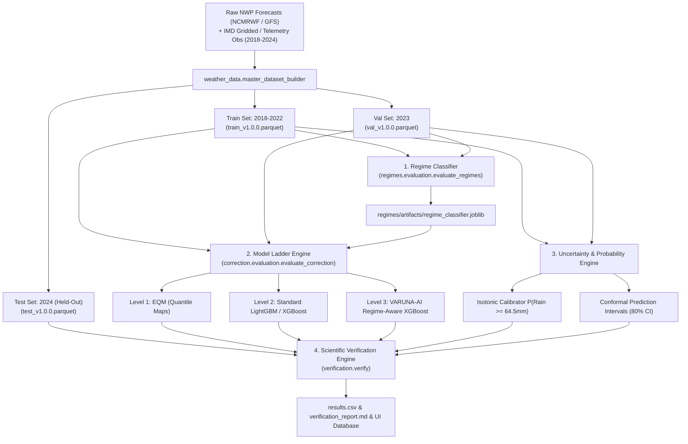

# VARUNA-AI: Master Dataset Ingestion & Model Training Guide
**Smart India Hackathon 2026 | Problem Statement: SIH26080**  
*Step-by-Step Practical Guide to Ingesting Data, Building Master Parquet Datasets, Training the Model Ladder, and Generating Scientific Benchmarks*

---

## Table of Contents
1. [Overview & Architecture of the Training Pipeline](#1-overview--architecture-of-the-training-pipeline)
2. [Prerequisites & Environment Setup](#2-prerequisites--environment-setup)
3. [Step 1: Ingesting & Building Master Parquet Datasets](#3-step-1-ingesting--building-master-parquet-datasets)
4. [Step 2: Training & Evaluating the Weather Regime Classifier](#4-step-2-training--evaluating-the-weather-regime-classifier)
5. [Step 3: Training the Rainfall Post-Processing Model Ladder (Levels 0–3)](#5-step-3-training-the-rainfall-post-processing-model-ladder-levels-03)
6. [Step 4: Training Probability & Conformal Uncertainty Quantiles](#6-step-4-training-probability--conformal-uncertainty-quantiles)
7. [Step 5: Running End-to-End Scientific Verification](#7-step-5-running-end-to-end-scientific-verification)
8. [Automated One-Shot Training Script](#8-automated-one-shot-training-script)
9. [Dataset Artifacts & Saved Model Registry (.joblib / .parquet)](#9-dataset-artifacts--saved-model-registry-joblib--parquet)
10. [Troubleshooting & Common Questions](#10-troubleshooting--common-questions)

---

## 1. Overview & Architecture of the Training Pipeline

The VARUNA-AI training pipeline processes multi-year meteorological datasets (2018–2024) across the Indian monsoon domain, extracts physics-based synoptic indices, guarantees zero future data leakage through strict chronological partitioning, and sequentially trains the 4-tier model hierarchy.



---

## 2. Prerequisites & Environment Setup

Ensure Python 3.10+ is installed on your system.

```bash
# 1. Clone or navigate to the repository
cd VARUNA-AI

# 2. Create and activate a dedicated virtual environment
python -m venv venv

# Windows (PowerShell):
.\venv\Scripts\Activate.ps1
# Linux / macOS:
# source venv/bin/activate

# 3. Install core dependencies
pip install -r requirements.txt
```

---

## 3. Step 1: Ingesting & Building Master Parquet Datasets

The master dataset builder orchestrates data loading, physical sanity validation, thermodynamic feature engineering, and chronological splitting.

### Command to Execute:
```bash
python -m weather_data.master_dataset_builder
```

### What Happens Internally:
1. **Raw Ingestion (`weather_data/ingestion/data_loader.py`):**
   - Synthesizes and loads aligned pairs of Raw NWP forecasts, ground telemetry observations, and synoptic pressure fields across 2018–2024.
2. **Synoptic Feature Extraction (`weather_data/features/synoptic_features.py`):**
   - Computes $850\text{ hPa}$ Somali Jet speed ($U_{850}$), $200\text{ hPa}$ Tropical Easterly Jet ($U_{200}$), Vertical Wind Shear ($VWS$), Monsoon Trough Axis latitude ($\Phi_{trough}$), CAPE, TCWV, and Orographic Moisture Flux.
3. **Physical Validation (`weather_data/preprocessing/validator.py`):**
   - Validates physical boundaries: Non-negative rainfall ($\ge 0\text{ mm}$), MSLP ($900 - 1050\text{ hPa}$), Relative Humidity ($0 - 100\%$).
   - Verifies **zero future data leakage** (ensures no future timestamps leak into training features).
4. **Chronological Splitting (`weather_data/temporal/temporal_aligner.py`):**
   - **Training Set (2018–2022):** 5 full Southwest Monsoon seasons.
   - **Validation Set (2023):** 1 full season for hyperparameter tuning & conformal calibration.
   - **Test Set (2024):** 1 full held-out season for independent scientific verification.
5. **Output Artifacts:** Saved in `weather_data/processed/` as:
   - `train_v1.0.0.parquet`
   - `val_v1.0.0.parquet`
   - `test_v1.0.0.parquet`
   - `master_v1.0.0.parquet`

---

## 4. Step 2: Training & Evaluating the Weather Regime Classifier

The regime classifier categorizes each day into one of the 6 synoptic regimes (`ACTIVE_MONSOON`, `BREAK_MONSOON`, `MONSOON_LOW_DEPRESSION`, `WESTERN_DISTURBANCE`, `OROGRAPHIC_RAINFALL`, `COASTAL_RAINFALL`).

### Command to Execute:
```bash
python -m regimes.evaluation.evaluate_regimes
```

---

## 5. Step 3: Training the Rainfall Post-Processing Model Ladder (Levels 0–3)

The model ladder trains all post-processing levels to establish rigorous progressive scientific gains.

### Command to Execute:
```bash
python -m correction.evaluation.evaluate_correction
```

### The 4 Levels Trained:
- **Level 0 (Raw NWP):** Direct grid point baseline without modification.
- **Level 1 (Empirical Quantile Mapping - EQM):** Non-parametric percentile matching per district grid cell.
- **Level 2 (Standard Machine Learning):** LightGBM / XGBoost regressor trained on NWP + local terrain features *without* regime information.
- **Level 3 (VARUNA-AI Regime-Aware XGBoost):** Advanced regressor incorporating one-hot regime vectors, synoptic jet indices, orographic moisture flux, and tweedie loss objective.

---

## 6. Step 4: Training Probability & Conformal Uncertainty Quantiles

```python
from probability.heavy_rainfall import HeavyRainfallProbabilityEstimator
from uncertainty.conformal_quantiles import ConformalQuantileEstimator
import pandas as pd

train_df = pd.read_parquet("weather_data/processed/train_v1.0.0.parquet")
val_df = pd.read_parquet("weather_data/processed/val_v1.0.0.parquet")

# 1. Fit Isotonic Heavy Rain Classifier (>= 64.5 mm)
prob_engine = HeavyRainfallProbabilityEstimator()
prob_engine.train_probability_models(train_df, val_df)

# 2. Fit Conformal Asymmetric Quantiles (10th and 90th percentiles)
uncertainty_engine = ConformalQuantileEstimator()
uncertainty_engine.fit_quantiles(train_df, val_df)
```

---

## 7. Step 5: Running End-to-End Scientific Verification

Executes the complete comparative verification across all 4 levels on the 2024 test season and exports verification reports.

### Command to Execute:
```bash
python -m verification.verify
```

---

## 8. Automated One-Shot Training Script

```bash
# Sequential end-to-end execution
python -m weather_data.master_dataset_builder && python -m regimes.evaluation.evaluate_regimes && python -m correction.evaluation.evaluate_correction && python -m verification.verify
```

---

## 9. Dataset Artifacts & Saved Model Registry

```
VARUNA-AI/
├── weather_data/processed/
│   ├── train_v1.0.0.parquet     # 2018-2022 Training Dataset
│   ├── val_v1.0.0.parquet       # 2023 Validation Dataset
│   ├── test_v1.0.0.parquet      # 2024 Independent Test Dataset
│   └── master_v1.0.0.parquet    # Unified Master Dataset
├── regimes/artifacts/
│   └── regime_classifier.joblib # Trained Synoptic GBDT Classifier
├── correction/artifacts/
│   ├── level1_eqm_model.joblib
│   ├── level2_standard_ml_model.joblib
│   └── level3_regime_aware_model.joblib
└── verification/
    ├── results.csv              # Machine-readable tabular verification benchmarks
    └── results.json             # JSON matrices for REST API & UI rendering
```
