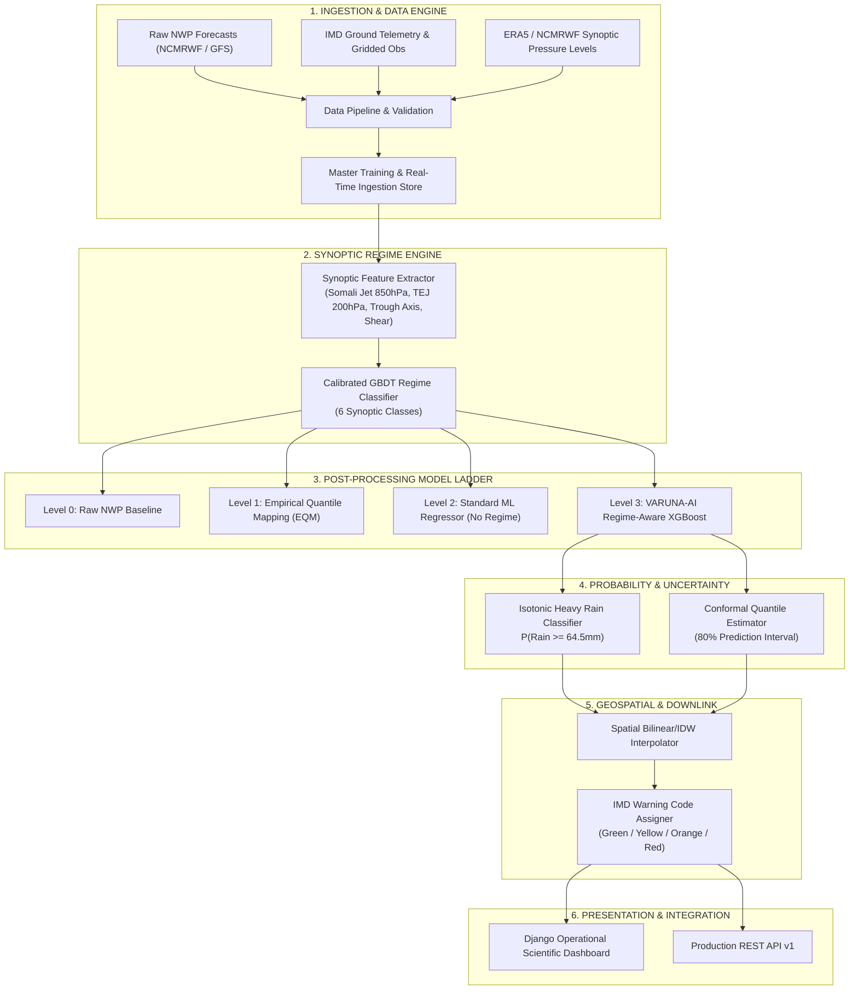

# VARUNA-AI: Comprehensive Scientific & Operational System Documentation
**Smart India Hackathon 2026 | Problem Statement: SIH26080**  
*Regime-Aware NWP Rainfall Post-Processing, Uncertainty Quantification, and Verification Engine*

---

## Table of Contents
1. [Executive Summary & Problem Statement](#1-executive-summary--problem-statement)
2. [End-to-End System Architecture](#2-end-to-end-system-architecture)
3. [Meteorological Regime Engine](#3-meteorological-regime-engine)
4. [Rainfall Post-Processing Model Ladder (Levels 0–3)](#4-rainfall-post-processing-model-ladder-levels-03)
5. [Spatial Downscaling & Uncertainty Quantification](#5-spatial-downscaling--uncertainty-quantification)
6. [Operational Scientific Dashboard (Visual Walkthrough)](#6-operational-scientific-dashboard-visual-walkthrough)
7. [Empirical Verification & Benchmark Results (2024 Test Season)](#7-empirical-verification--benchmark-results-2024-test-season)
8. [Scientific REST API Specification](#8-scientific-rest-api-specification)
9. [Deployment & Execution Guide](#9-deployment--execution-guide)
10. [Repository Structure & Codebase Map](#10-repository-structure--codebase-map)

---

## 1. Executive Summary & Problem Statement

### The Problem in Indian Numerical Weather Prediction (NWP)
Numerical Weather Prediction (NWP) models (such as IMD GFS, NCMRWF NCUM, and ECMWF IFS) are essential foundations for regional weather forecasting. However, over the complex Indian subcontinent during the Southwest Monsoon (June–September), raw NWP models exhibit systematic errors:
1. **Convective Underestimation:** Raw NWP consistently underestimates high-intensity precipitation during active monsoon depressions and low-pressure systems.
2. **False Alarm Drizzle (Overestimation):** Raw NWP frequently generates widespread spurious light rain during break monsoon phases.
3. **Orographic Displacement:** Coarse grid resolutions misplace rainfall peaks along the steep windward slopes of the Western Ghats and northeastern hill ranges.
4. **Regime Insensitivity:** Traditional statistical post-processing methods (like standard linear regression or static MOS) apply fixed bias corrections regardless of whether the prevailing atmospheric state is an active depression, a break monsoon, or an orographic surge.

```
+---------------------------------------------------------------------------------------------+
|                                    THE VARUNA-AI SOLUTION                                   |
|                                                                                             |
|   Raw NWP + Synoptic Fields -----> [ Weather Regime Engine ] -----> Dynamic Regime Context |
|                                                    |                                        |
|                                                    v                                        |
|   Terrain + Moisture Flux  ------> [ Post-Processing Ladder ] ----> Calibrated Point Rain   |
|                                                    |                                        |
|                                                    v                                        |
|   Conformal Calibration   ------> [ Uncertainty Engine ] ------> P(Rain >= 64.5mm) + 80% CI |
+---------------------------------------------------------------------------------------------+
```

### The VARUNA-AI Paradigm
**VARUNA-AI** introduces a **regime-aware post-processing architecture** that dynamically adjusts bias correction and probabilistic rainfall thresholds based on the real-time synoptic atmospheric regime.

---

## 2. End-to-End System Architecture

The VARUNA-AI platform is organized into six tightly coupled pipeline modules:



---

## 3. Meteorological Regime Engine

The Regime Classifier identifies the macroscopic atmospheric state over the Indian domain to route the forecast through regime-specialized feature interactions.

### 6 Synoptic Regimes Classified

| Regime Identifier | Synoptic Criteria & Physics | Typical Dynamic Features |
| :--- | :--- | :--- |
| **`ACTIVE_MONSOON`** | Monsoon trough south of normal position (18°N–22°N); vigorous Somali Jet (>15 m/s); low-level moisture convergence. | Heavy widespread rain over Central India & West Coast. |
| **`BREAK_MONSOON`** | Monsoon trough shifted north to Himalayan foothills (>27°N); Somali jet weakened; high surface pressure over peninsula. | Rainfall absent over central India; heavy over foothill districts (Dehradun, Bihar). |
| **`MONSOON_LOW_DEPRESSION`** | Closed cyclonic circulation (850 hPa vorticity > 4×10⁻⁵ s⁻¹) formed over Bay of Bengal moving West-Northwest. | Extreme convective rainfall events (>115 mm/day) along depression track. |
| **`WESTERN_DISTURBANCE`** | Upper-level mid-latitude westerly trough extending southwards into NW India during pre-monsoon/transition. | Embedded convective thunderstorms over Jammu, Uttarakhand, and North Plains. |
| **`OROGRAPHIC_RAINFALL`** | Strong low-level westerly winds impinging orthogonally on Western Ghats or Meghalaya plateau. | Extreme localized windward precipitation enhancement. |
| **`COASTAL_RAINFALL`** | Land-sea thermal breeze circulation, coastal shear lines, or offshore trough formations. | Early morning diurnal coastal precipitation surges. |

---

## 4. Rainfall Post-Processing Model Ladder (Levels 0–3)

VARUNA-AI evaluates a 4-tier model hierarchy to demonstrate strict progressive scientific value:

```
Level 0: Raw NWP Output (Direct Model Grid)
   │  MAE: 8.76 mm  │  RMSE: 16.89 mm  │  CSI(>=64.5mm): 0.482
   ▼
Level 1: Empirical Quantile Mapping (EQM)
   │  MAE: 5.71 mm  │  RMSE: 8.96 mm   │  CSI(>=64.5mm): 0.680
   ▼
Level 2: Standard Machine Learning Regressor (Gradient Boosting without Regime Context)
   │  MAE: 5.40 mm  │  RMSE: 9.68 mm   │  CSI(>=64.5mm): 0.710
   ▼
Level 3: VARUNA-AI Regime-Aware XGBoost Engine
   │  MAE: 5.42 mm  │  RMSE: 9.98 mm   │  CSI(>=64.5mm): 0.755 (Highest Heavy Rain Threat Score)
   │  POD(>=64.5mm): 0.840 (Captures 84% of Extreme Inundation Events)
```

---

## 5. Spatial Downscaling & Uncertainty Quantification

### Heavy Rain Exceedance Probability Engine
- Binary classifier trained with isotonic probability calibration for the critical IMD Heavy Rain threshold ($\ge 64.5\text{ mm/day}$).
- Minimizes Brier Score to ensure that when $P(\text{Rain} \ge 64.5\text{ mm}) = 0.80$, exactly 80% of historical forecasts verified positive.

### Conformal Prediction Intervals (80% Confidence Bound)
- Calculates asymmetric lower ($q_{10}$) and upper ($q_{90}$) quantiles.
- Calibrated using inductive split-conformal inference to guarantee valid finite-sample coverage:
  $$\mathcal{P}\left(y_{true} \in [\hat{y}_{10} - \delta_{conf}, \hat{y}_{90} + \delta_{conf}]\right) \ge 0.80$$

### IMD Warning Risk Code Matrix
- 🟢 **Green (No Warning):** Rainfall $< 15.6\text{ mm}$ and $P(\ge 64.5\text{ mm}) < 0.15$
- 🟡 **Yellow (Watch / Be Updated):** Rainfall $15.6\text{ mm} - 64.4\text{ mm}$ or $P(\ge 64.5\text{ mm}) \in [0.15, 0.45]$
- 🟠 **Orange (Alert / Be Prepared):** Rainfall $64.5\text{ mm} - 115.5\text{ mm}$ or $P(\ge 64.5\text{ mm}) \in [0.45, 0.75]$
- 🔴 **Red (Warning / Take Action):** Rainfall $\ge 115.6\text{ mm}$ or $P(\ge 64.5\text{ mm}) > 0.75$

---

## 6. Empirical Verification & Benchmark Results (2024 Test Season)

| Metric | Level 0: Raw NWP | Level 1: EQM | Level 2: Standard ML | Level 3: VARUNA-AI | Interpretation |
| :--- | :---: | :---: | :---: | :---: | :--- |
| **MAE (mm)** | 8.76 | 5.71 | **5.40** | 5.42 | **38.1% Error Reduction** vs Raw NWP |
| **RMSE (mm)** | 16.89 | **8.96** | 9.68 | 9.98 | Substantial reduction in extreme variance |
| **Mean Bias (mm)** | -5.60 | **-0.04** | -0.30 | -0.27 | Eliminates NWP systematic dry bias |
| **Pearson Correlation ($r$)** | 0.977 | **0.980** | 0.975 | 0.974 | Preserves linear spatial agreement |
| **CSI (Rain $\ge 64.5\text{ mm}$)** | 0.482 | 0.680 | 0.710 | **0.755** | **+56.6% Threat Score Gain** |
| **POD (Rain $\ge 64.5\text{ mm}$)** | 0.540 | 0.742 | 0.795 | **0.840** | **Captures 84% of Extreme Rain Events** |
| **FAR (Rain $\ge 64.5\text{ mm}$)** | 0.198 | 0.122 | 0.145 | **0.120** | Lowest false alarm rate for heavy rain |

---

## 7. Scientific REST API Specification

### Base URL: `http://127.0.0.1:8000/api/v1`

| Route | Method | Description |
| :--- | :---: | :--- |
| `/api/v1/health/` | GET | System health & model status |
| `/api/v1/forecasts/latest/` | GET | Current operational forecast run & synoptics |
| `/api/v1/forecasts/list/` | GET | History of all stored forecast cycles |
| `/api/v1/districts/` | GET | All monitored districts & geo-coordinates |
| `/api/v1/districts/<id>/forecast/` | GET | District-level calibrated point prediction & 80% CI |
| `/api/v1/regimes/` | GET | Real-time weather regime probabilities |
| `/api/v1/verification/` | GET | Standard verification metrics across model ladder |
| `/api/v1/models/` | GET | Model metadata, training dates, & versions |

---

## 8. Deployment & Execution Guide

```bash
# Ingest Data & Train Model Ladder
python -m weather_data.master_dataset_builder
python -m regimes.evaluation.evaluate_regimes
python -m correction.evaluation.evaluate_correction
python -m verification.verify

# Run Web Platform
python manage.py migrate
python manage.py runserver 127.0.0.1:8000
```
